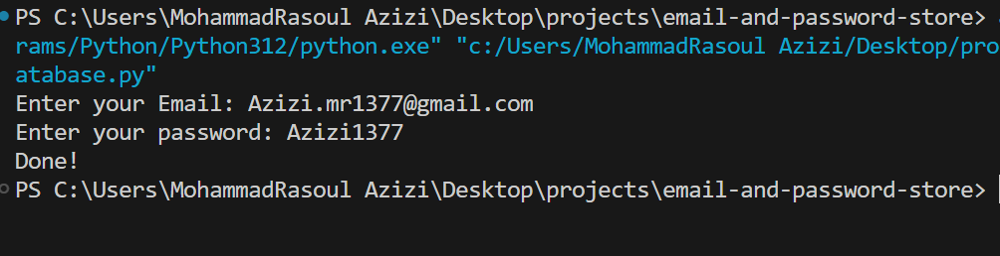
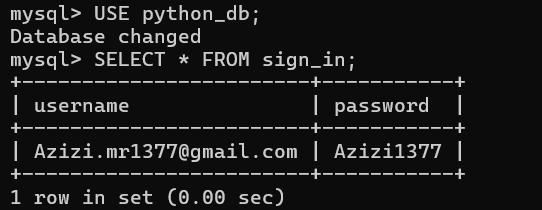

# email-and-password-store
In this project, an attempt has been made to receive and store users' emails and passwords in the mysql database with python

This program is produced in a file that you can see in the repository:

In the menu below, we have put a list of contents for you.

## Menu
+ <a href="#guide">Program guide</a>
+ <a href="#">Program structure</a>

<h2 id='guide'>Program Guide</h2>

for using this program, you must have mysql DataBase on your system and download mysql-connctor-python module.

for guide to install and download mysql DataBase on your system you can <a href='https://www.w3schools.com/mysql/mysql_install_windows.asp'>Click Here!.</a>

so Enter below command in your Terminal or Command Promt (cmd):

> `pip install mysql-connector-python`

 Another Point: 

+ for using this program you must change your "DataBase_name" , "User_name, "Password" with your information in line 45.

after all of this points, you can run the program and can see the "Enter your Email: " then see "Enter your password: " in terminal. <a href="#picture1">(like picture one)</a>

after you entered the email and password, the information saved in database and you can access them by mysql database.<a href="#picture2">(like picture two)</a>

<h2 id='structure'>Program structure</h2>

It use two module:
+ <a href="#re">re</a>
+ <a href="#mysql">mysql-connector</a>

and including three function:

+ <a href="#valid_email">valid_email</a>
+ <a href="#email_password">get_email_password</a>
+ <a href="#main">main</a>

<h3>Modules</h3>

<h4 id="re">re module:</h4>
...

<h4 id="mysql">mysql-connector module:</h4>
...

<h3>Fucntions</h3>

<h4 id="valid_email">valid_email:</h4>
...

<h4 id="email_password">getting_email_password:</h4>
...

<h4 id="main">main:</h4>
...